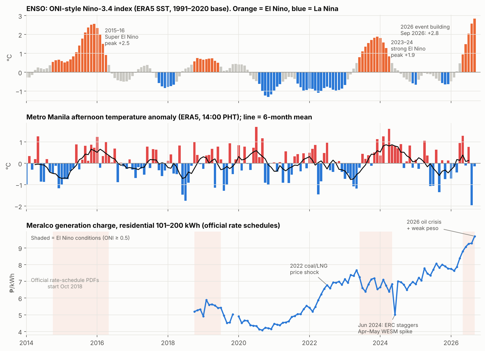
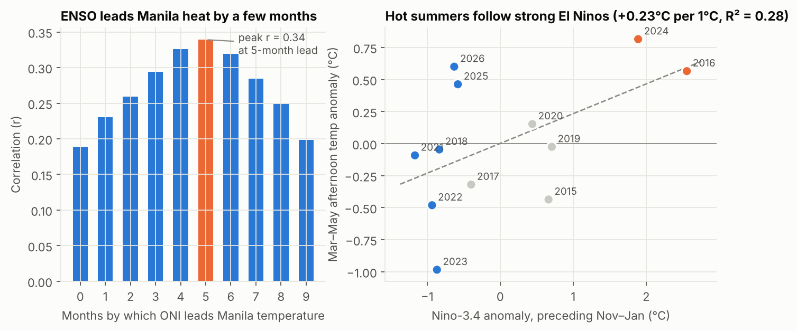
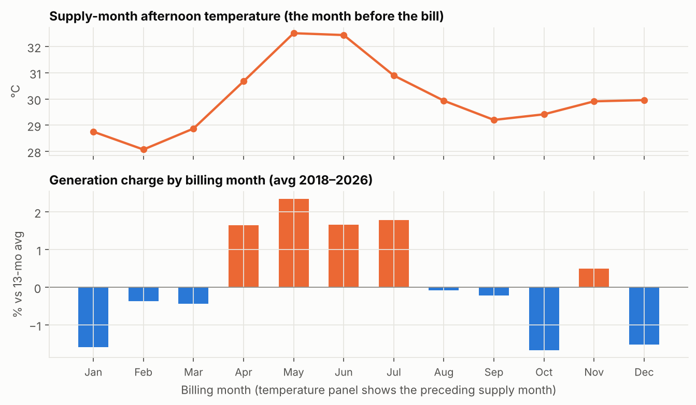
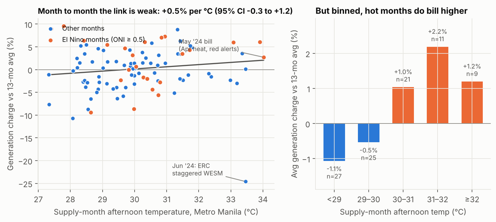
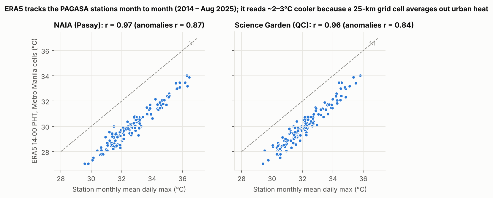

# Super El Niño, Metro Manila Heat, and the Meralco Generation Charge

**Question:** When a (super) El Niño hits, how much does the heat in Metro Manila push up the price of electricity?

**Short answer:** El Niño reliably makes Manila's *next* summer hotter. Hot months reliably bill higher. But the El Niño-specific extra heat doesn't show up as a clean, statistically measurable bump in Meralco's *blended* generation charge. The heat premium is real but modest (≈2.5% between hot and cool months). Spot-market (WESM) stress during red/yellow-alert weeks can add ~7% in a single bill. Fuel prices, the peso, and regulator intervention (ERC) routinely swamp both.

> Context (Oct 2026): NOAA's Climate Prediction Center issued an El Niño Advisory on 10 Sep 2026, with a >90% chance of a very strong event this winter and a ~75% chance of a historic one. PAGASA puts the odds of a very strong El Niño for Oct 2026–Jan 2027 at 81%. **Next 6 months (Nov 2026 – Apr 2027 bills):** expect Manila afternoons **+0.2 °C rising to +0.8 °C** above normal. Generation charge: **≈ +1% to +4% (+₱20 to +₱85/month for 200 kWh)**, largest in the April 2027 bill (see §3). The bigger exposure is the **Apr–Jun 2027 dry-season bills** (see §4).



---

## Key findings

| # | Finding | Evidence |
|---|---|---|
| 1 | **El Niño heats Manila with a ~5-month lag.** ENSO's winter peak lines up with the Mar–May dry season. | Correlation of ONI with Manila afternoon-temperature anomaly peaks at **r = 0.34 at a 5-month lead** (Fig. 2). |
| 2 | **The two strongest El Niños produced two of the hottest summers.** 2016 (after the 2015–16 Super El Niño) was **+0.57 °C** and 2024 (after 2023–24) was **+0.82 °C**, the largest Mar–May anomaly in 2015–2026. April 2024 was the hottest month in the record (34.0 °C ERA5 afternoon mean). | Mar–May anomaly rises **+0.23 °C per +1 °C** of Nov–Jan Niño-3.4 (R² = 0.28, p = 0.08, n = 12 summers). |
| 3 | **Hot summers also happen without El Niño.** 2025 (+0.46 °C) and 2026 (+0.60 °C) followed *La Niña*-leaning winters, so El Niño explains only part of summer heat. | Fig. 2, right panel. |
| 4 | **There is a clear seasonal heat premium in the bill.** Apr–Jul bills (which reflect Mar–Jun supply costs) average **+1.9%** above the 13-month trend vs **−0.7%** for the rest of the year. | Difference **2.5 pp, Welch p = 0.007** (30 vs 63 months, Oct 2018–Sep 2026) (Fig. 4). |
| 5 | **Month-to-month, temperature explains little of the generation charge.** Each +1 °C in the supply month goes with **+0.5%** (95% CI −0.3 to +1.2%, R² = 0.10). The *anomaly* part (hotter than a normal April) is ≈ 0. | Robust to year fixed effects (+0.7%/°C, p = 0.25) and to heat index instead of temperature (Fig. 3). |
| 6 | **The El Niño channel is the spot market, and it's episodic.** In the 2024 El Niño summer, WESM charges rose **+₱1.01/kWh** (Apr bill) and **+₱1.79/kWh** (May bill) on yellow/red alerts. The blended generation charge moved only **−₱0.36** then **+₱0.45 (+7.0%)**, because WESM was just 25–30% of Meralco's supply. | Meralco rate advisories, Apr & May 2024. |
| 7 | **Regulation and fuel can erase the weather signal.** ERC made utilities stagger May-2024 WESM costs over four months, so the **June 2024 bill fell ₱1.83/kWh** at the peak of the heat. In 2015–16 the Super El Niño coincided with the oil/coal price collapse, and Meralco rates *fell*. | Fig. 1 bottom; 2015–16 notes below. |

---

## 1. Does El Niño make Metro Manila hotter?



* My ONI-style index (3-month Niño-3.4 anomaly from ERA5 sea-surface temperature, 1991–2020 base) reproduces NOAA's published peaks: **+2.56 vs +2.6 for 2015–16**, **+1.89 vs +2.0 for 2023–24**. It currently reads **+2.84 (Sep 2026)**, already above the 2015–16 peak, and the event is still strengthening.
* The link is strongest 4–6 months later, which is why winter El Niño peaks show up as hot **March–May** dry seasons.
* With n = 12 summers the dry-season regression is only borderline significant (p = 0.08). The direction and lag are consistent with PAGASA's climatology, but don't read it as a precise forecast.

| Summer (Mar–May) | Nov–Jan Niño-3.4 (°C) | Afternoon temp anomaly (°C) |
|---|---:|---:|
| 2016 (after 2015–16 Super El Niño) | +2.56 | **+0.57** |
| 2024 (after 2023–24 strong El Niño) | +1.89 | **+0.82** |
| 2025 | −0.58 | +0.46 |
| 2026 | −0.63 | +0.60 |
| 2023 | −0.87 | −0.98 |

Full table: [`data/processed/dry_season_vs_enso.csv`](data/processed/dry_season_vs_enso.csv)

**If the 2026–27 event peaks at +2.0 / +2.5 / +3.0 °C**, the fitted relationship implies a Mar–May 2027 afternoon anomaly of about **+0.5 / +0.6 / +0.7 °C**. That would put 2027 in 2024 territory.

## 2. Does heat raise the price of electricity?

**Price variable:** the residential (101–200 kWh) **generation charge** from Meralco's official monthly *Summary Schedule of Rates*, Oct 2018 – Sep 2026 (95 months). Generation is the only bill component that moves with power-market conditions; distribution, metering, etc. are regulated flat rates.

**Timing:** Meralco bills month *M* using supply-month *M−1* generation costs, so temperature is matched to the bill with a 1-month lag.

**Removing fuel/FX:** the generation charge more than doubled from 2020 to 2026, driven by coal/LNG prices, the 2026 oil shock, and the weaker peso. The analysis uses each month's deviation from its own centred 13-month average, so only within-year movement is left. A year fixed-effects model gives the same answer.



**The seasonal pattern is clear.** Bills for April through July, which carry the cost of the hottest supply months, sit consistently above trend. May bills (April supply) are the highest at **+2.35%**. October–January bills are the cheapest (≈ −1.6%).



**Month to month, the link is weak.** Generation charge on supply-month temperature:

| Model | Effect per +1 °C | 95% CI | p |
|---|---:|---:|---:|
| Deviation from 13-mo avg ~ supply-month temp | +0.48% | −0.25 to +1.21 | 0.20 |
| …split: seasonal (normal temp of that month) | +0.62% | −0.15 to +1.40 | 0.11 |
| …split: anomaly (hotter than normal for that month) | −0.03% | −1.53 to +1.47 | 0.97 |
| log(generation charge) ~ temp + year fixed effects | +0.66% | −0.47 to +1.78 | 0.25 |
| Deviation ~ heat index (temp + humidity) | +0.22% / °C HI | −0.21 to +0.65 | 0.31 |

All models use HAC (Newey-West) standard errors and a dummy for the ERC-staggered June/July 2024 bills. Full output: [`data/processed/regression_summaries.txt`](data/processed/regression_summaries.txt).

**Why the El Niño anomaly is hard to see in the bill:**
1. **Portfolio dilution.** Most of Meralco's supply comes under bilateral PSAs/IPPs priced on fuel indices, not on Manila's weather. Only the WESM slice (roughly 10–30% of supply) reprices with grid tightness.
2. **Regulatory smoothing.** ERC's June 2024 staggering order spread the worst El Niño month's spot costs over Jun–Sep bills. That is exactly when the heat signal should have peaked.
3. **Bigger shocks dominate.** The 2022 coal/LNG spike and the 2026 Middle-East oil shock plus weak peso moved the generation charge by ₱2–₱3/kWh. Seasonal weather moves it by about ₱0.2.
4. **Only one strong El Niño falls inside the price window.** Official rate schedules start Oct 2018, so the 2015–16 Super El Niño can't be tested on the same data.

### Case study: the 2024 El Niño summer (Meralco's own numbers)

| Bill month | Supply-month conditions | WESM charge | Generation charge | Typical-household rate |
|---|---|---:|---:|---:|
| Mar 2024 | | | ₱6.7502 | ₱11.9397 |
| Apr 2024 | March: Luzon demand +618 MW, outages +473 MW | **+₱1.0114** | ₱6.3889 (−₱0.36; IPP/PSA costs fell) | ₱10.9518 |
| May 2024 | April: demand +2,401 MW; 3 Yellow-alert days + 5 Yellow/Red days; secondary price cap hit 19% of the time; Luzon WESM average ₱5.34 → ₱6.63/kWh | **+₱1.7913** | ₱6.8344 (**+₱0.45, +7.0%**) | ₱11.4139 |
| Jun 2024 | ERC orders May-supply WESM costs staggered over Jun–Sep | deferred | ₱5.0036 (**−₱1.83**) | ₱9.4516 |
| Jul 2024 | WESM normalises + first deferred instalment | +₱6.6370 | ₱7.0057 (+₱2.00) | ₱11.6012 |

The same pattern returned in **2026**, a few months *before* El Niño matured. Red alerts on 13–15 May 2026 pushed WESM to ₱7.03/kWh, and the June 2026 generation charge rose to ₱9.0704.

### The 2015–16 Super El Niño: heat without a price spike

Meralco's rate schedules for 2015–16 aren't in its public archive, so this is from press reports and a compiled rate history (lower confidence):
* Summer 2016 was +0.57 °C (ERA5), with Yellow alerts on five days in June 2016.
* Generation charges *fell* through the event, from ≈₱4.72/kWh (Jan 2015) to ≈₱3.92/kWh (Jan 2016). Global oil and coal prices collapsed at the same time.
* The typical-household rate went from ≈₱9.7 in early 2015 to ≈₱8.4–8.7 through mid-2016.
* The largest heat-driven price signal was a ₱0.29/kWh rise in the July 2016 bill.

In other words, the super El Niño's heat was real, but the fuel cycle overwhelmed it.

## 3. The next 6 months: PAGASA's very strong El Niño window (Oct 2026 – Mar 2027)

PAGASA: **81% chance of a very strong El Niño Oct 2026 – Jan 2027**, 97% chance it persists into the first half of 2027. It expects **way-below-normal rainfall from December to March**, and DOST warns the whole country could be in drought by **March 2027**. This weather lands in the **Nov 2026 – Apr 2027 Meralco bills**.

**Temperature.** In Oct–Mar, Manila's afternoon temperature anomaly rises **+0.27 °C per +1 °C of ONI five months earlier** (p = 0.002, 72 months). Oct 2026 – Feb 2027 can therefore be forecast from ONI values already observed (May–Sep 2026); only March 2027 needs an assumption (Oct 2026 ONI ≈ +3.0). Both past strong events back this up: Oct–Mar averaged **+0.52 °C in 2015–16** and **+0.53 °C in 2023–24**.

| Weather month | Bill month | ONI 5 mo earlier | Afternoon temp anomaly (80% range) | Heat-index anomaly | Normal bill vs trend | Heat-only price effect (200 kWh) |
|---|---|---:|---:|---:|---:|---:|
| Oct 2026 | Nov 2026 | +0.95 | **+0.2 °C** (−0.5 to +0.9) | +0.3 °C | +0.5% | +₱0.01/kWh (+₱2) |
| Nov 2026 | Dec 2026 | +1.49 | **+0.4 °C** (−0.4 to +1.1) | +0.4 °C | −1.5% | +₱0.02/kWh (+₱4) |
| Dec 2026 | Jan 2027 | +2.05 | **+0.5 °C** (−0.2 to +1.3) | +0.6 °C | −1.6% | +₱0.02/kWh (+₱5) |
| Jan 2027 | Feb 2027 | +2.58 | **+0.7 °C** (−0.1 to +1.4) | +0.8 °C | −0.4% | +₱0.03/kWh (+₱7) |
| Feb 2027 | Mar 2027 | +2.84 | **+0.7 °C** (0.0 to +1.5) | +0.9 °C | −0.4% | +₱0.03/kWh (+₱8) |
| Mar 2027 | Apr 2027 | ≈ +3.0 | **+0.8 °C** (0.0 to +1.6) | +0.9 °C | **+1.7%** | +₱0.04/kWh (+₱8) |

*"Normal bill vs trend" is the usual seasonal position of the generation charge for that bill month. Peso amounts use the Sep 2026 generation charge (₱9.7032/kWh) plus 12% VAT and hold fuel, FX and contracts constant.*

**Price, two ways:**
1. **Heat alone** (temperature → generation charge model, +0.48%/°C): only **+₱0.01 to +₱0.04/kWh**, i.e. **₱2–8/month** for a 200 kWh home. The confidence interval includes zero.
2. **Whole El Niño seasons** (Nov–Apr bills in each season since 2018 vs ENSO strength): bills ran **+1.3% above trend per +1 °C of ONI** (p = 0.15, only 8 seasons). The 2023–24 strong El Niño season ran about **+1%** above an ENSO-neutral one. Extrapolating to a very strong event (ONI ≈ +3) gives about **+4%** (≈ +₱0.38/kWh). This channel also picks up drought, low hydro and supply tightness, not just heat.

**Expected effect for Nov 2026 – Apr 2027 bills:** roughly **+1% to +4% on the generation charge, ≈ +₱0.10 to +₱0.38/kWh, or about +₱20 to +₱85/month** for a 200 kWh household.
* **Dec–Mar bills:** normally the cheapest of the year, so El Niño mostly cancels the usual cool-season dip rather than producing a visible spike.
* **April 2027 bill:** where it starts to bite. The seasonal premium (+1.7%), March heat (+0.8 °C) and drought-reduced hydro all stack.
* **May–June 2027 bills:** the bigger exposure falls just *after* this 6-month window (see the scenarios below).

Treat the top end (+4%) as an extrapolation. No past season in the price data was this strong.

Output: [`data/processed/outlook_next_6_months.csv`](data/processed/outlook_next_6_months.csv)

## 4. Outlook: what the 2026–27 event could mean for Apr–Jun 2027 bills

Scenarios applied to the Sep 2026 generation charge (₱9.7032/kWh) and a 200 kWh household, including 12% VAT on the generation charge:

| Scenario | Generation charge | ₱/kWh | 200 kWh bill |
|---|---:|---:|---:|
| A. Normal summer (seasonal premium only) | +1.9% | +₱0.18 | **+₱41/month** |
| B. 2024-style tight grid (the May-2024 one-month jump) | +7.0% | +₱0.68 | **+₱152/month** |
| C. Both | +8.8% | +₱0.86 | **+₱192/month** |

Caveats on the outlook:
* **Price per kWh is the smaller effect for households.** In a hot month, air-conditioning raises kWh use. A 200 kWh home that goes to 250 kWh pays ~25% more before any rate change. Consumption isn't modelled here (no public Meralco sales series by month).
* **Fuel and FX will likely matter more than weather.** The generation charge already rose ₱1.96/kWh in Jan–Sep 2026 on the oil shock and weak peso, about 10× the seasonal heat premium.
* **ERC may smooth any spike again** (as in June 2024). That delays the cost but doesn't remove it.

---

## Data

| Source | What | Coverage | How obtained |
|---|---|---|---|
| **Meralco Summary Schedule of Rates** (official PDFs) | Residential 101–200 kWh generation charge | Oct 2018 – Sep 2026 (93 PDFs + 2 months from Meralco press releases; Dec 2019 missing) | `src/fetch_meralco.py`, from Meralco's public S3 bucket |
| **ERA5 reanalysis** (ECMWF, via Google's public ARCO-ERA5 Zarr) | 2 m temperature (14:00 & 05:00 PHT) and dew point over 3 Metro Manila grid cells; Niño-3.4 SST | Manila 2014 – Sep 2026; SST 1991 – Sep 2026 (ERA5T preliminary after Jun 2026) | `src/fetch_era5.py` (samples every 2nd day for Manila, every 5th day for SST) |
| **NOAA GHCN-Daily** | NAIA and Science Garden daily max temperature (PAGASA stations) | 2014 – Aug 2025 (mirror ends there) | `src/fetch_stations.py`, used to validate ERA5 |
| Meralco rate advisories, IEMOP, NOAA CPC, PAGASA | Narrative facts (WESM moves, alerts, ENSO outlook) | — | cited below |

**ERA5 validation** (Fig. 5): monthly ERA5 afternoon temperature tracks the station monthly mean daily max with **r = 0.97 (NAIA)** and **0.96 (Science Garden)**. For anomalies it is **0.87 / 0.84**. ERA5 reads 2–3 °C cooler because a 25 km grid cell averages out the urban heat island and 14:00 isn't exactly the daily max. All analysis uses anomalies, so the offset doesn't matter.



**Typical-household overall rate** (`overall_rate` column) is secondary and only used in the narrative. Months tagged `meralco_official` were checked against Meralco's announcements. Months tagged `compiled` come from a third-party compilation, which I found to be wrong in at least three months (May/Jun/Sep 2024), so treat those as indicative.

### Outputs
* [`data/processed/monthly_panel.csv`](data/processed/monthly_panel.csv): one row per month with every variable used
* [`data/processed/meralco_rates.csv`](data/processed/meralco_rates.csv): generation charge + overall rate with source flags
* [`data/processed/stats.json`](data/processed/stats.json): every number quoted above
* `data/processed/*.csv`: dry-season tables and outlook scenarios

## Reproduce

```bash
pip install -r requirements.txt
python src/fetch_meralco.py   # ~100 PDFs, a few MB
python src/fetch_stations.py  # 2 station files
python src/fetch_era5.py      # streams ~20 GB of ERA5 chunks (only point values are kept); ~10 min on a fast link
python src/analysis.py        # builds panel, figures/, data/processed/
```

## Limitations

* **Price window.** Official rate schedules only go back to Oct 2018, so the strongest past event (2015–16) can't be tested quantitatively on price.
* **Detrending.** The 13-month detrend removes slow fuel/FX moves but not sudden ones. There is no explicit fuel-price control (World Bank/EIA feeds were unreachable from the build environment).
* **Generation charge only.** It's a blended portfolio price. WESM alone is far more weather-sensitive, but a clean monthly Luzon WESM series wasn't available (published figures mix preliminary and final values).
* **ONI definition.** My index is the traditional (absolute) Niño-3.4 anomaly. NOAA now headlines the *relative* index (RONI), which subtracts tropical-mean warming and reads lower, so compare event to event within this index, not to RONI values.
* **Sampling.** ERA5 is sampled at fixed hours on alternating days, which is enough for monthly means but not for daily extremes.

## Sources
* Meralco rate advisories: [April 2024](https://company.meralco.com.ph/news-and-advisories/april-2024-rates-updates), [May 2024](https://company.meralco.com.ph/news-and-advisories/may-2024-rates-update), [June 2024](https://company.meralco.com.ph/news-and-advisories/june-2024-rates-update), [July 2024](https://company.meralco.com.ph/news-and-advisories/july-2024-rates-updates), [September 2024](https://company.meralco.com.ph/news-and-advisories/september-2024-rates-updates), [June 2026](https://company.meralco.com.ph/news-and-advisories/higher-residential-rates-june-2026), [August 2026](https://company.meralco.com.ph/news-and-advisories/lower-rates-august-2026), [September 2026](https://company.meralco.com.ph/news-and-advisories/lower-rates-september-2026), [The 2026 Oil-Driven Energy Crisis](https://company.meralco.com.ph/2026-oil-driven-energy-crisis)
* IEMOP: [Sustained high demand affects market prices in April till mid-May 2024](https://www.iemop.ph/news/sustained-high-demand-affects-market-prices-in-april-till-mid-may-2024/)
* NOAA CPC: [ENSO Diagnostic Discussion, Sep 2026](https://www.cpc.ncep.noaa.gov/products/analysis_monitoring/enso_disc_sep2026/ensodisc.shtml)
* GMA News: [Very strong El Niño likely from October 2026 to January 2027 — PAGASA](https://www.gmanetwork.com/news/weather/content/996484/very-strong-el-ni-o-likely-from-october-2026-to-january-2027-pagasa/story/)
* Philippine Star: [DOST: Entire Philippines could be under drought conditions in March 2027](https://philstar.com/headlines/weather/2026/10/05/2561112/dost-entire-philippines-could-be-under-drought-conditions-march-2027)
* Philippine Star (via PressReader): [Electricity rates up 29¢/kWh this month (Jul 2016)](https://www.pressreader.com/philippines/the-philippine-star/20160706/281530815344159)
* Compiled pre-2018 rates: [pinas.solar Meralco rate data](https://www.pinas.solar/solar-guides/meralco-rate-data) (lower confidence, see Data)
* ERA5: Hersbach et al. (2020), via [ARCO-ERA5](https://github.com/google-research/arco-era5); GHCN-Daily: Menne et al. (2012), via the [NOAA Open Data Dissemination program on AWS](https://registry.opendata.aws/noaa-ghcn/)
